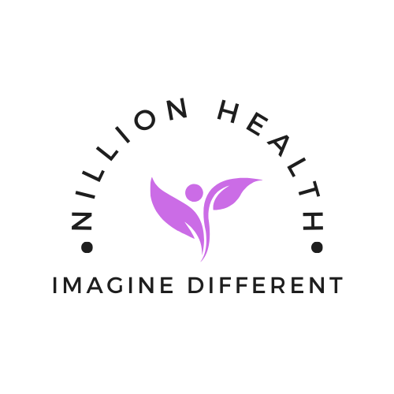

# Nillion Health

 

Nillion Health is a program that demonstrates the power of blind computation in a healthcare setting. Making use of Nillion's multiparty computation, the program provides a breast cancer image classification test performed over multiple health providers.

## Problem:
The article *"Sharing Is Caring-Data Sharing Initiative in Healthcare"*[[1]](#1) highlights a concern in regards to who gets accessed to all the health data. High valued data is expected to further grow in value due to advances in AI/ML and other emerging technologies. Do you know if you're health provider can provide you the best care when you need it?

## Objective: 
Make use of modern cryptography to prevent barriers in the healthcare industry and ensure the world's most important data type, medical imaging, can be shared in a way that is fair and secure.

# Demo


# About the program

## ✅ Secure Multi-Party Computation (Blind computation)

- [Nillion](https://nillion.com/) - Nillion is a secure computation network that decentralizes trust for high value data in the same way that blockchains decentralized transactions.

## ✅ Diagnostic Imaging Cancer Data

- [UC Irvine Machine Learning Repository](https://archive.ics.uci.edu/dataset/17/breast+cancer+wisconsin+diagnostic) - The dataset used in the program is related to diagnostic imaging data focused on breast cancer classification. As included in the site's information, the features are computed from a digitized image of a fine needle aspirate (FNA) of a breast mass. It describes characteristics of the cell nuclei present in the image.


## ✅ Setup

Clone repo and change into `nillion-python-starter` directory 
```
$ cd nillion-python-starter
```

Create a python virtual environment and activate
```
$ python3 -m venv .venv/

source .venv/bin/activate
```

Install dependencies
```
pip install -r requirements.txt
```

Initialize Nillion environment and compile `Nada` program
```
./bootstrap-local-environment.sh

./compile_programs.sh
```

Change to `healthcare_imaging_compute` directory and run program
```
cd healthcare_imaging_compute

python3 healthcare_imaging_compute.py
```

## ✅ References
<a id="1">[1]</a>
Hulsen T. Sharing Is Caring-Data Sharing Initiatives in Healthcare. Int J Environ Res Public Health. 2020 Apr 27;17(9):3046. doi: 10.3390/ijerph17093046. PMID: 32349396; PMCID: PMC7246891.

## ✨ Project Member 👨‍💻

Created for [ETHGlobal Scaling Ethereum 2024](https://ethglobal.com/events/scaling2024) by:

- [Chris Salvador](https://github.com/csalvador58) 

